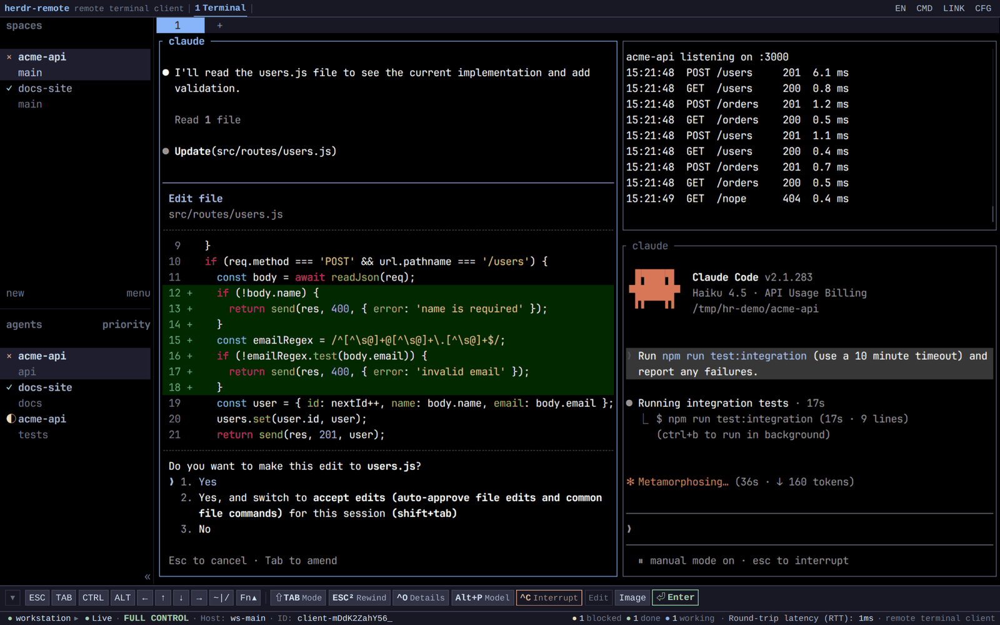
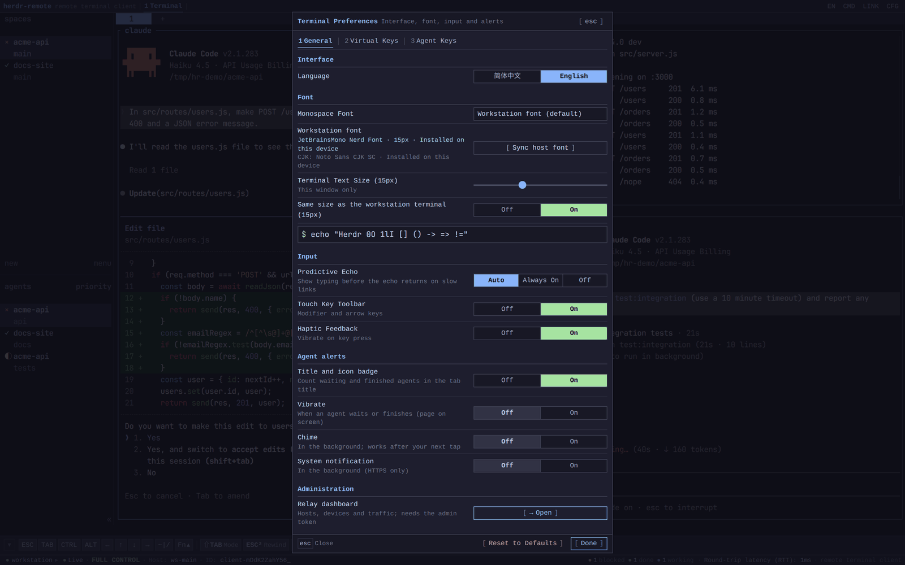
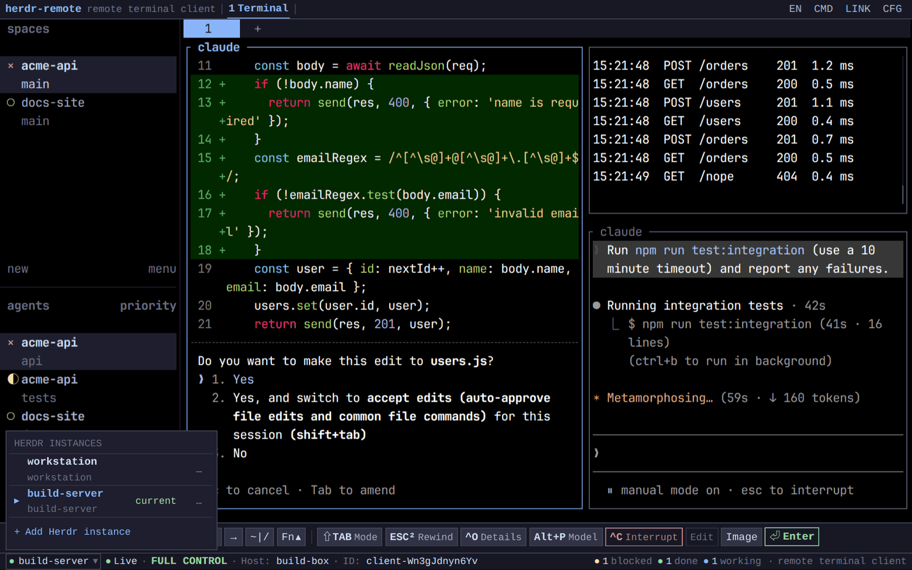
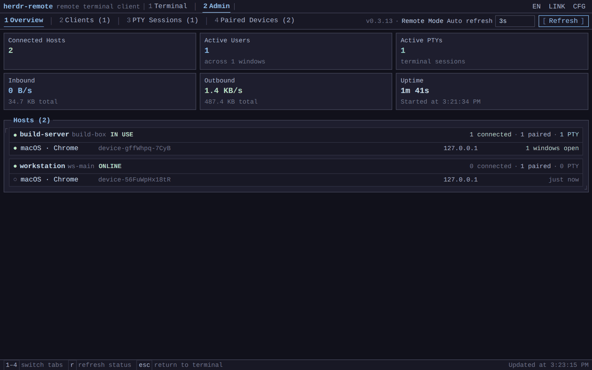
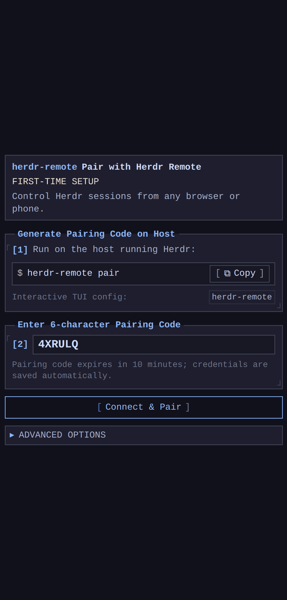
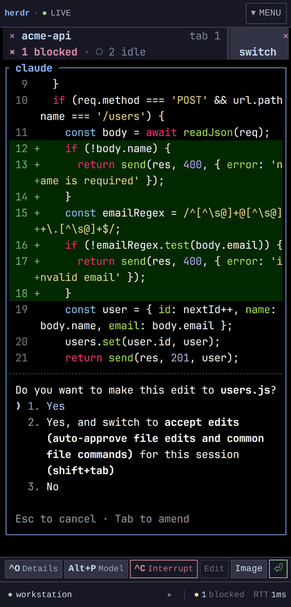
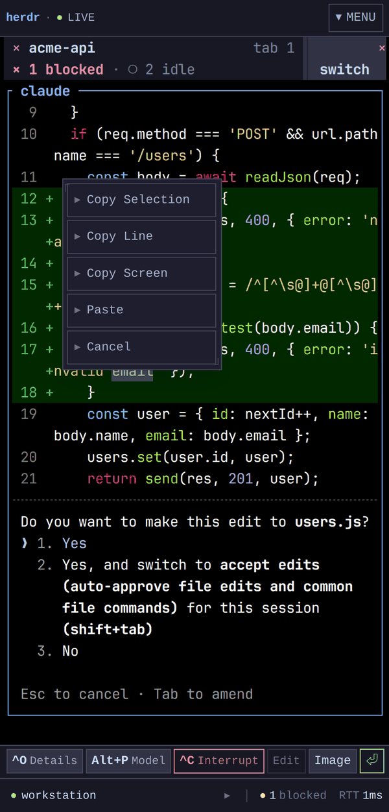
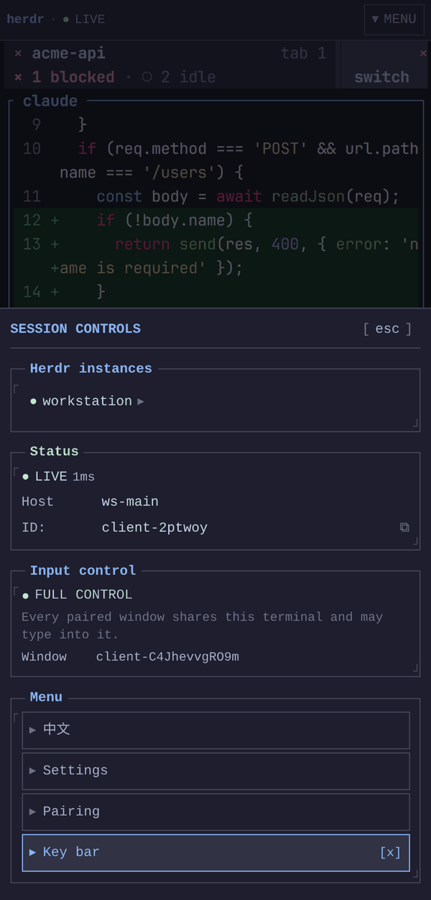
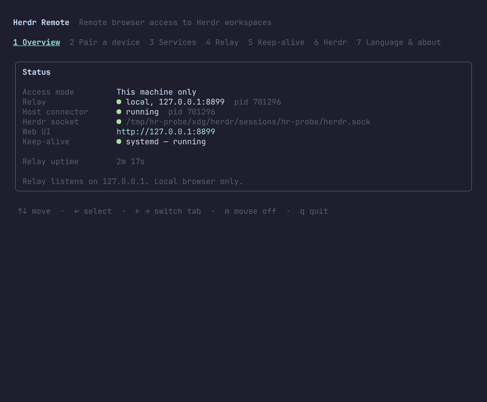
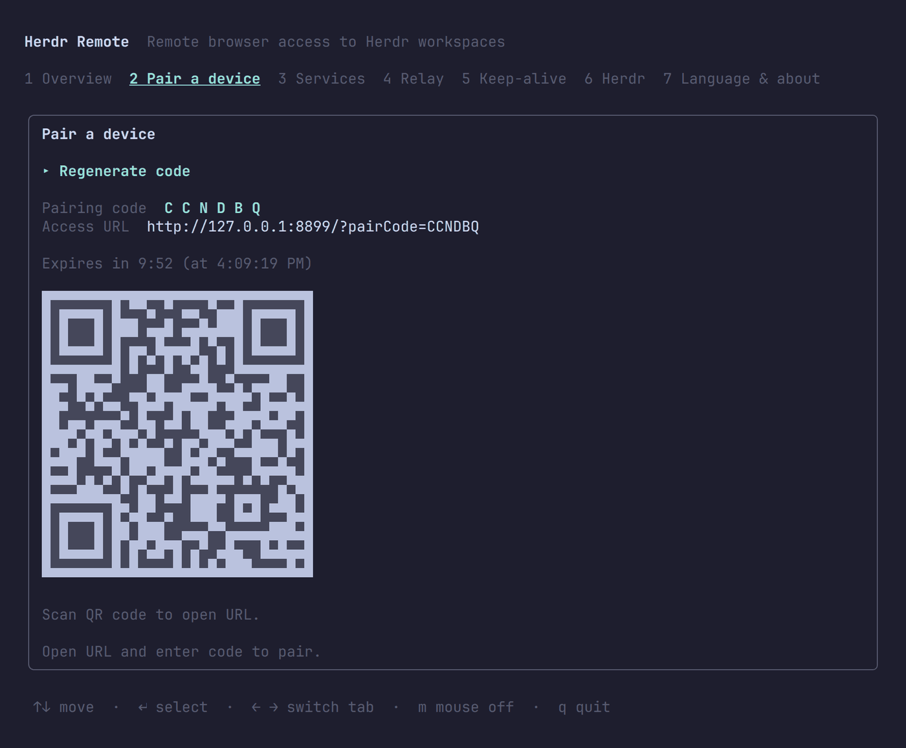

# Herdr Remote

*[English](README.md) · [简体中文](README.zh-CN.md)*

[](https://www.npmjs.com/package/herdr-remote)
[](https://www.npmjs.com/package/herdr-remote-relay)
[](https://nodejs.org)
[](./LICENSE)

Your [Herdr](https://herdr.dev) workspaces in any browser, phone included. See which coding
agents are working, waiting for you or finished, answer them from wherever you are, and keep
typing into the same terminals you left on the workstation.

```bash
npm install -g herdr-remote
herdr-remote
```

The first run opens a setup wizard; after that the relay and host connector run in the
background.

Requires Herdr 0.9.1 or newer. Each browser window drives its own Herdr client, which is only
independent from the workstation's own terminal from 0.9.0 on, and 0.9.1 is what makes that
model behave in a browser: window titles follow each client's own view, activating a machine in
the background no longer resizes somebody else's focused pane, and a large paste no longer
drops the client.

## Screenshots

### Desktop browser

| Your workspace in a browser tab | Terminal preferences |
| :---: | :---: |
|  |  |
| Every pane, tab and agent Herdr draws. The status line counts agents that are blocked, done or working, and the key bar carries the focused agent's own shortcuts. | Use the workstation's terminal font and size, turn on predictive echo for slow links, and choose how waiting agents get your attention. |
| **Several workstations in one browser** | **Relay dashboard** |
|  |  |
| Pair more than one Herdr and switch between them from the status line. Names and credentials stay in this browser. | With the admin token, a relay shows its workstations, their paired devices and its traffic, and can revoke a device. |

### Phone

| Pair | Answer an agent | Copy from the terminal | Session controls |
| :---: | :---: | :---: | :---: |
|  |  |  |  |
| Type the 6-character code, or open the link in the QR code. | A blocked agent's prompt, answered with the key bar. | Long-press to copy a selection, a line or the whole screen, or to paste. | Workstation, connection, language, settings and key bar in one sheet. |

### Workstation

| Status at a glance | Pair a device |
| :---: | :---: |
|  |  |
| `herdr-remote` shows the relay, host connector, Herdr socket and keep-alive service. | A single-use code and QR code, valid for 10 minutes. |

## Features

**The basics**

- **Herdr in a browser.** Every paired window drives its own Herdr client over one low-latency
  ANSI stream, so a phone and a laptop can look at different workspaces at the same time.
- **One-time pairing.** A 6-character code or a QR code; the device token it issues works for that
  one workstation only.
- **Built for phones.** A touch key bar with Esc, Tab, Ctrl, Alt, arrows, symbols and F-keys,
  long-press copy and paste, and every other control in one sheet.
- **Four ways to connect.** This machine only, your LAN or Tailnet, the official relay, or a relay
  you host yourself.
- **Setup and services.** A bilingual configuration TUI, and a keep-alive service under systemd,
  launchd or a built-in supervisor.

**The highlights**

- **Agent status everywhere.** Counts of blocked, finished and working agents in the status line
  and, if you want, in the tab title, as a vibration, a chime or a system notification.
- **Agent shortcut keys.** The key bar follows the agent in the focused pane (Claude Code, Codex,
  Gemini CLI and 21 more), and each agent's keys can be rearranged or rebound.
- **The workstation's look.** The browser draws with the workstation terminal's colours, font and
  size; a device without the font loads it over the relay, CJK characters as they appear.
- **Predictive echo.** On a slow link your typing shows before the echo comes back.
- **Images from the phone.** A photo or screenshot is saved on the workstation and its path is
  typed into the agent's prompt.
- **Several workstations** in one browser, and a **relay dashboard** for whoever runs the relay.

## Packages

| Package | Target | Description |
|---|---|---|
| **`herdr-remote`** | Workstation | Herdr plugin, host connector, and configuration TUI |
| **`herdr-remote-relay`** | Anywhere | Standalone WebSocket relay and WebUI assets |

`herdr-remote` runs a local relay automatically unless configured to use an external one.

## Connection Modes

| Mode | Reachability | External Server |
|---|---|---|
| **This machine only** *(default)* | Local workstation browser | No |
| **Local network / Tailscale** | Devices on LAN or Tailnet | No |
| **Official relay** | Internet | No (`wss://herdr-remote.564616.xyz`) |
| **Self-hosted relay** | Internet | Yes ([Guide](docs/self-hosted-relay.md) · [中文](docs/self-hosted-relay.zh-CN.md)) |

Reading a workstation on a 40-column screen is worth a few settings of Herdr's own: see
[Herdr on a phone screen](docs/herdr-on-a-phone.md).

## Pairing

1. Open the **Pair a device** tab in the TUI, or run `herdr-remote pair`.
2. Scan the QR code, or open the Web UI and enter the 6-character code.
3. Codes expire after 10 minutes and work once.

To add another workstation to the same browser, choose **Add Herdr instance** in the switcher at
the left of the status line and enter that workstation's code. Only the active workstation keeps a
connection open, which keeps relay traffic down.

## Configuration TUI

Run `herdr-remote` without arguments. It speaks English and Chinese and follows `$LANG` unless
told otherwise.

| Key | Action |
|---|---|
| `↑` `↓` | Move |
| `↵` | Select or edit |
| `←` `→` or `1`–`7` | Switch tab |
| `s` | Save |
| `r` | Refresh status |
| `m` | Toggle mouse |
| `q` | Quit |

## Keep-Alive Service

Install the background service from the **Keep-alive** tab or the CLI:

- **Linux**: systemd user unit (`loginctl enable-linger` keeps it running after logout)
- **macOS**: LaunchAgent
- **Anything else**: a built-in supervisor process

```bash
herdr-remote keepalive install | uninstall | restart | status
```

## CLI Reference

```bash
herdr-remote                      # Configuration TUI
herdr-remote start | stop | restart
herdr-remote status [--json]
herdr-remote pair [--json]
herdr-remote url
herdr-remote keepalive install | uninstall | restart | status
herdr-remote plugin link | unlink | status   # Register as a native Herdr plugin
herdr-remote --lang zh|en
```

## Configuration

Settings: `~/.config/herdr-remote/config.json`

```json
{
  "ui":        { "language": "auto" },
  "relay":     { "mode": "local", "port": 8787, "lanHost": "", "publicUrl": "", "remoteUrl": "" },
  "herdr":     { "socketPath": null, "args": [], "autoStart": false },
  "keepalive": { "manager": "auto" }
}
```

Authentication tokens and secrets are stored in `~/.local/state/herdr-remote/runtime.json`
(mode `0600`).

## Security

- Device tokens are bound to one workstation. `/api/status` is workstation-scoped, ordinary users cannot enumerate other Herdr instances, and relay-wide status requires the operator token.
- Relay brokers WebSocket streams without running shells or accessing local sockets directly.
- Authentication tokens are hashed with SHA-256; terminal content is never written to disk.
- Every paired window drives its own terminal with full input; pairing, not a control lease, is the permission boundary.
- Pairing codes are single-use, rate-limited, and expire in 10 minutes.

## Development

```bash
npm ci                            # Install (node-pty needs a build toolchain)
npm run build                     # Build the relay, WebUI and CLI
npm test                          # Every test suite; builds first
npm run check                     # Biome, type check and knip
npm run dev -w herdr-remote-web   # WebUI dev server, proxied to a relay on 127.0.0.1:8787
node scripts/render-bench.mjs     # Frame cost of the terminal renderer (needs Playwright)
```

## License

MIT
