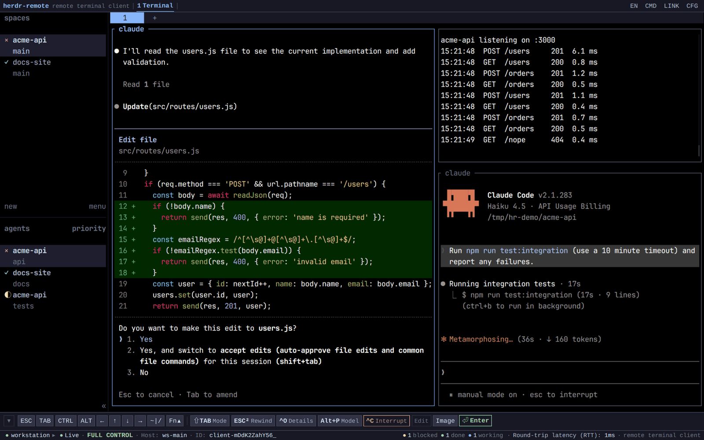
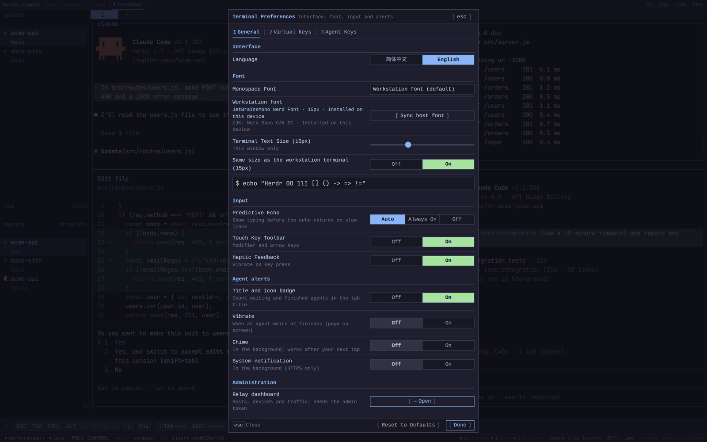
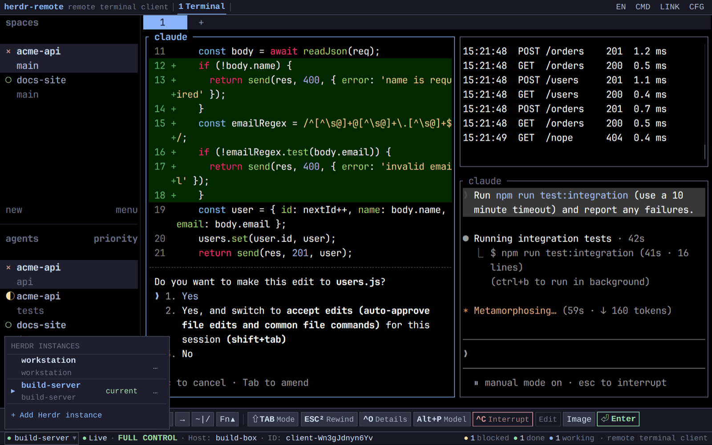
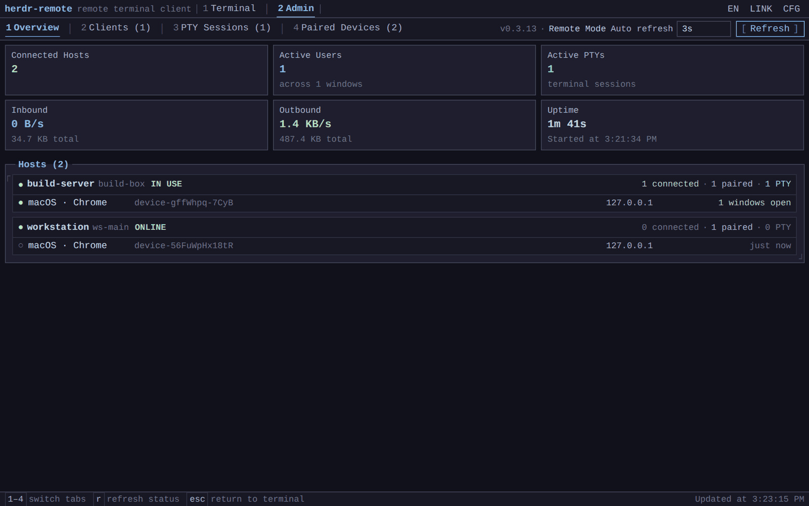
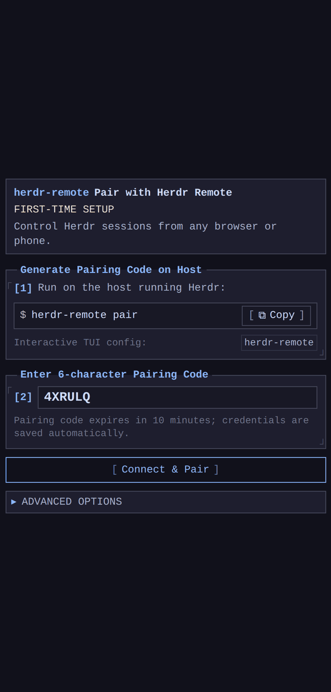
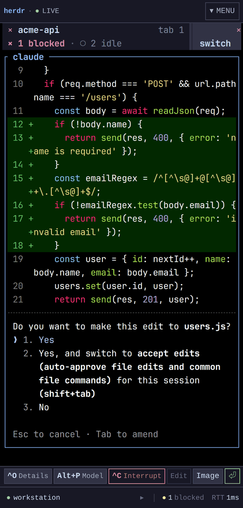
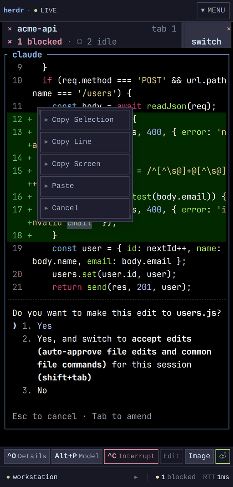
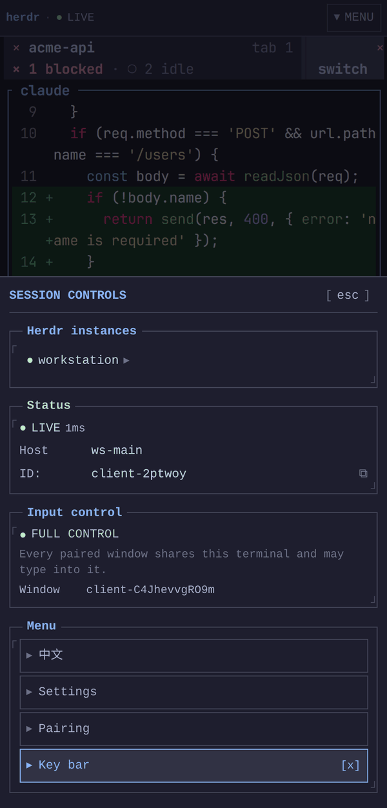
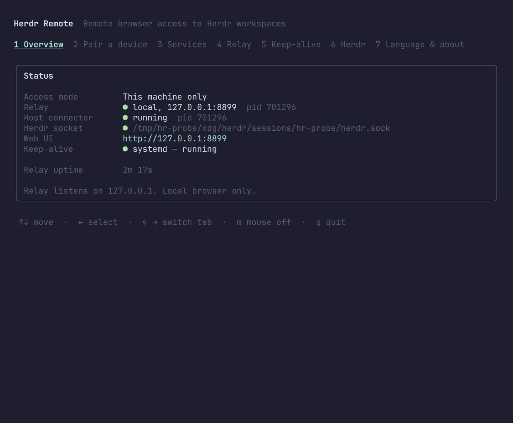
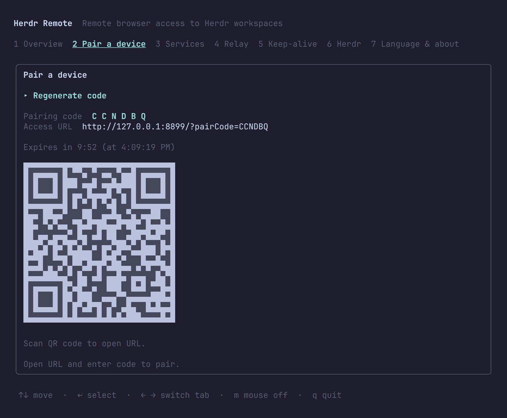

# Herdr Remote

*[English](README.md) · [简体中文](README.zh-CN.md)*

[](https://github.com/dibin666/herdr-remote/releases/latest)
[](https://nodejs.org)
[](./LICENSE)

Your [Herdr](https://herdr.dev) workspaces in any browser, phone included. See which coding agents are working, waiting for you, or finished, answer them from wherever you are, and keep typing into the same terminals you left on the workstation.

## Quick Start

### Requirements

- Node.js ≥ 22
- [Herdr](https://herdr.dev) ≥ 0.9.3

### Installation

```bash
npm install -g https://github.com/dibin666/herdr-remote/releases/latest/download/herdr-remote.tgz
herdr-remote
```

The first run launches a setup wizard, after which the services run in the background.

## Screenshots

### Desktop browser

| Your workspace in a browser tab | Terminal preferences |
| :---: | :---: |
|  |  |
| **Several workstations in one browser** | **Relay dashboard** |
|  |  |

### Phone

| Pair | Answer an agent | Copy from the terminal | Session controls |
| :---: | :---: | :---: | :---: |
|  |  |  |  |

### Workstation Configuration TUI

| Status at a glance | Pair a device |
| :---: | :---: |
|  |  |

## Features

- **Independent Multi-Client Views**: Each paired window runs an independent Herdr client, allowing mobile devices and desktop browsers to navigate different workspaces simultaneously.
- **Quick & Secure Pairing**: Connect via a 6-character one-time pairing code or QR code; device tokens are scoped strictly to the paired workstation.
- **Mobile-First Experience**: Touch-friendly key bar with Esc, Tab, Ctrl, Alt, arrow keys, symbols, and F-keys, alongside long-press copy and quick paste.
- **Agent Status Awareness**: Real-time tracking of blocked, running, and finished agents, with optional tab title badges, vibrations, audio chimes, and system notifications.
- **Context-Aware Agent Shortcuts**: Key bar dynamically adapts to the active agent (supporting 24 agents including Claude Code, Codex, and Gemini CLI), with customizable order and keybindings.
- **Native Terminal Styling**: Preserves workstation terminal color schemes, fonts, and sizes, with dynamic font streaming and predictive echo on high-latency links. The interface ships with Maple Mono NF CN, so Chinese and Japanese text stays exactly two cells wide on any device.
- **Windows Shell Support**: Key bar recognizes CMD, PowerShell, and Git Bash, with quick creation of elevated terminal tabs in Herdr.
- **Mobile Image Uploads**: Send photos or screenshots from your phone directly to the workstation, inserting local file paths straight into the agent prompt.
- **Flexible Connection Modes**: Supports local-only, LAN / Tailscale, official public relay, or self-hosted relays.
- **Multi-Workstation Management**: Manage and switch between multiple Herdr workstations from a single browser session, with an operator dashboard for relay administrators.
- **Cross-Platform**: Runs on Linux, macOS, and Windows 10/11 with a bilingual TUI and background service supervisors.

## License

MIT
