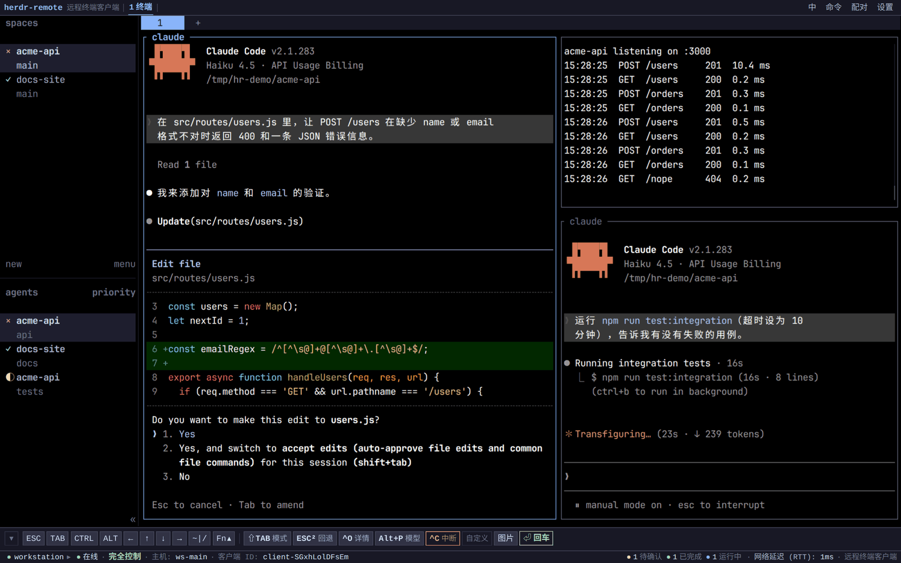
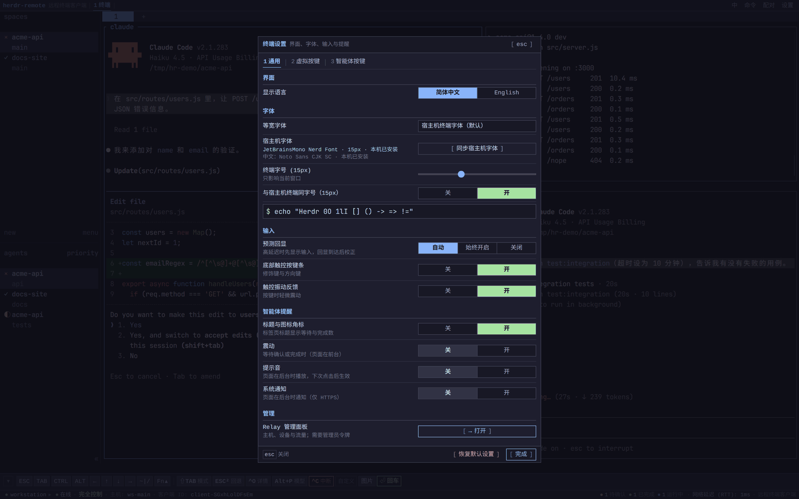
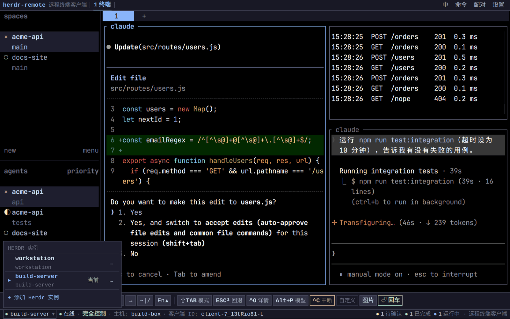
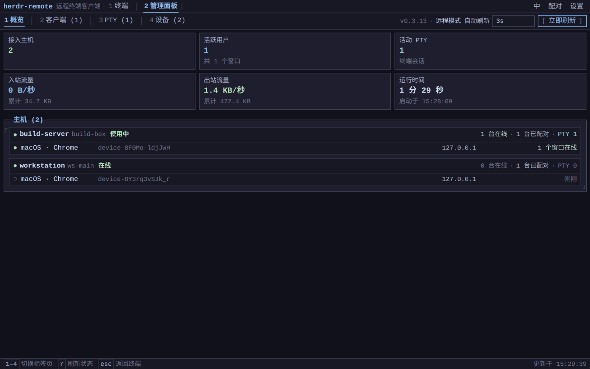
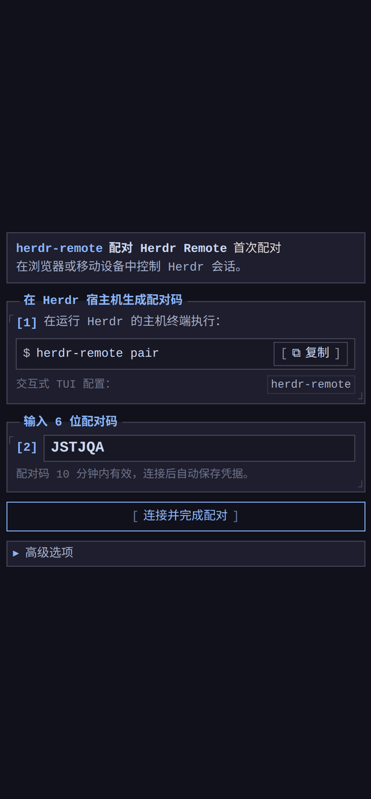
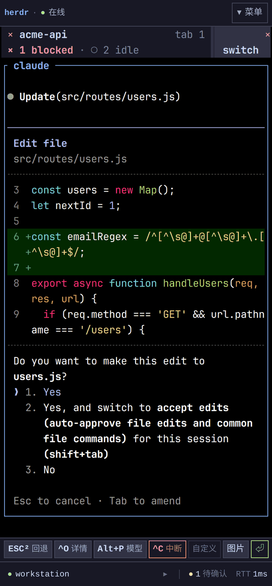
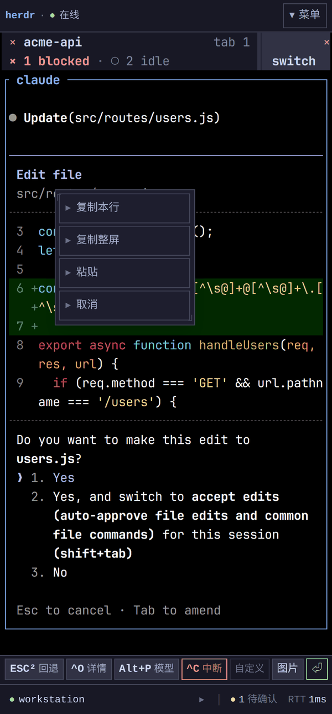
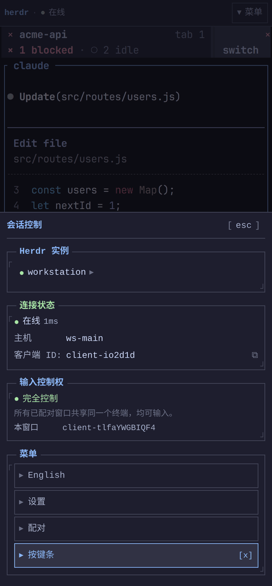
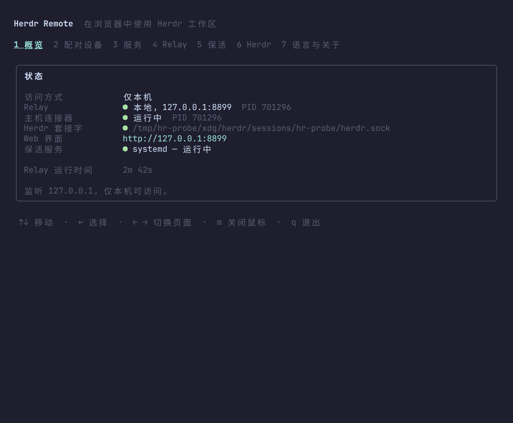
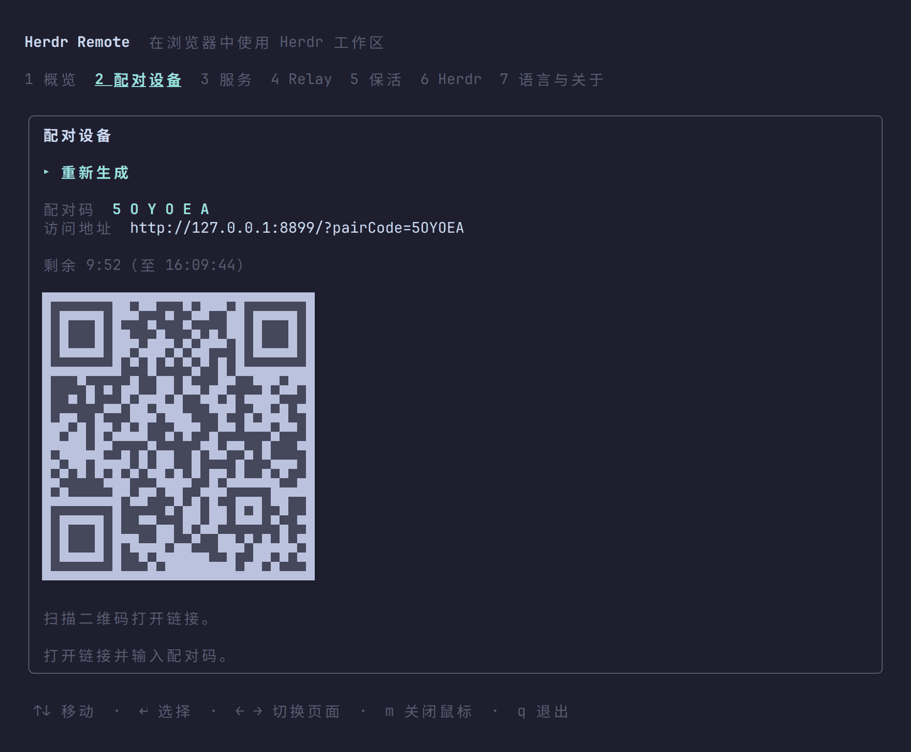

# Herdr Remote

*[English](README.md) · [简体中文](README.zh-CN.md)*

[](https://www.npmjs.com/package/herdr-remote)
[](https://www.npmjs.com/package/herdr-remote-relay)
[](https://nodejs.org)
[](./LICENSE)

在任意浏览器（包括手机）里使用 [Herdr](https://herdr.dev) 工作区。随时看到哪些编码智能体在运行、在等你确认、已经完成，在哪里都能回应它们，并继续在工作站上那几个终端里输入。

```bash
npm install -g herdr-remote
herdr-remote
```

首次运行会打开配置向导，之后 relay 和主机连接器在后台运行。

需要 Herdr 0.9.1 或更高版本。每个浏览器窗口驱动各自的 Herdr 客户端，客户端视图从 0.9.0 起才与工作站本机终端相互独立；而 0.9.1 才让这套模型在浏览器里真正可用：窗口标题跟随各自客户端的视图、后台激活机器不再改变他人聚焦窗格的尺寸、大段粘贴也不再断开客户端。

## 截图

### 桌面浏览器

| 浏览器标签页里的工作区 | 终端设置 |
| :---: | :---: |
|  |  |
| Herdr 画出的每个窗格、标签页和智能体都在这里。状态栏统计待确认、已完成、运行中的智能体，按键栏带着当前智能体自己的快捷键。 | 沿用工作站终端的字体和字号，慢速网络下开启预测回显，并选择智能体等待时如何提醒你。 |
| **一个浏览器，多台工作站** | **Relay 管理面板** |
|  |  |
| 配对多台 Herdr，在状态栏左侧切换。名称和凭据只保存在当前浏览器。 | 凭管理员令牌查看 relay 上的工作站、各自已配对的设备和流量，并可吊销设备。 |

### 手机

| 配对 | 回应智能体 | 从终端复制 | 会话控制 |
| :---: | :---: | :---: | :---: |
|  |  |  |  |
| 输入 6 位配对码，或打开二维码里的链接。 | 智能体在等待确认，用按键栏直接回应。 | 长按即可复制选区、整行或整屏，也可粘贴。 | 工作站、连接状态、语言、设置和按键栏都在一个面板里。 |

### 工作站

| 状态一览 | 配对设备 |
| :---: | :---: |
|  |  |
| `herdr-remote` 显示 relay、主机连接器、Herdr 套接字和保活服务的状态。 | 一次性配对码和二维码，10 分钟内有效。 |

## 功能

**基础功能**

- **浏览器里的 Herdr。** 每个已配对窗口通过一条低延迟 ANSI 数据流驱动自己的 Herdr 客户端，手机和笔记本可以同时看不同的工作区。
- **一次性配对。** 输入 6 位配对码或扫描二维码；发放的设备令牌只对这一台工作站有效。
- **为手机设计。** 触控按键栏提供 Esc、Tab、Ctrl、Alt、方向键、符号和 F 键，长按复制与粘贴，其余控制集中在一个面板里。
- **四种连接方式。** 仅本机、局域网或 Tailnet、官方 relay、自建 relay。
- **配置与服务。** 中英双语的配置界面（TUI），以及基于 systemd、launchd 或内置守护进程的保活服务。

**特色功能**

- **智能体状态随处可见。** 状态栏统计待确认、已完成、运行中的智能体；也可以显示在标签页标题里，或以震动、提示音、系统通知提醒你。
- **智能体快捷键。** 按键栏跟随当前窗格里的智能体（Claude Code、Codex、Gemini CLI 等 24 种），每种智能体的按键都可以调整顺序或重新绑定。
- **沿用工作站的外观。** 浏览器使用工作站终端的配色、字体和字号；设备上没有该字体时通过 relay 加载，中文字形随用随取。
- **预测回显。** 网络较慢时，输入内容先于回显显示出来。
- **从手机发图片。** 照片或截图保存到工作站，文件路径自动输入到智能体的提示框里。
- **一个浏览器管理多台工作站**，relay 运营者还有**管理面板**可用。

## 包含的包

| 包名 | 运行位置 | 说明 |
|---|---|---|
| **`herdr-remote`** | 工作站 | Herdr 插件、主机连接器、配置 TUI |
| **`herdr-remote-relay`** | 任意机器 | 独立 WebSocket relay 服务及 WebUI 静态资源 |

`herdr-remote` 默认在本地启动 relay，也可连接外部独立部署的 relay。

## 访问模式

| 模式 | 可访问范围 | 需要独立服务器 |
|---|---|---|
| **仅本机** *(默认)* | 本机浏览器 | 否 |
| **局域网 / Tailscale** | 局域网或 Tailnet 内设备 | 否 |
| **官方 Relay** | 互联网任意网络 | 否（使用 `wss://herdr-remote.564616.xyz`） |
| **自建 Relay** | 互联网任意网络 | 是（[自建指南](docs/self-hosted-relay.zh-CN.md) · [English](docs/self-hosted-relay.md)） |

在 40 列的手机屏幕上读一台工作站，值得调整 Herdr 自身的几项设置：见
[Herdr on a phone screen](docs/herdr-on-a-phone.md)。

## 设备配对

1. 在 TUI 中打开**配对设备**页面，或运行 `herdr-remote pair`。
2. 扫描二维码，或打开 Web 界面输入 6 位配对码。
3. 配对码 10 分钟有效，且仅可使用一次。

要在同一个浏览器里再加一台工作站，在状态栏左侧的实例切换器中选择“添加 Herdr 实例”，输入那台工作站的配对码即可。只有当前实例保持连接，以减少 relay 流量。

## 配置界面 (TUI)

直接执行 `herdr-remote` 打开配置界面，支持中英双语，默认跟随 `$LANG`。

| 按键 | 作用 |
|---|---|
| `↑` `↓` | 移动光标 |
| `↵` | 选择或编辑 |
| `←` `→` 或 `1`–`7` | 切换页面 |
| `s` | 保存配置 |
| `r` | 刷新状态 |
| `m` | 开关鼠标支持 |
| `q` | 退出 |

## 后台保活服务

可在**保活**页面或通过命令行安装后台服务：

- **Linux**：systemd 用户单元（开启 `loginctl enable-linger` 后注销也保持运行）
- **macOS**：LaunchAgent
- **其他系统**：内置守护进程

```bash
herdr-remote keepalive install | uninstall | restart | status
```

## 命令行

```bash
herdr-remote                      # 配置界面 (TUI)
herdr-remote start | stop | restart
herdr-remote status [--json]
herdr-remote pair [--json]
herdr-remote url
herdr-remote keepalive install | uninstall | restart | status
herdr-remote plugin link | unlink | status   # 注册为 Herdr 原生插件
herdr-remote --lang zh|en
```

## 配置文件

配置文件路径：`~/.config/herdr-remote/config.json`

```json
{
  "ui":        { "language": "auto" },
  "relay":     { "mode": "local", "port": 8787, "lanHost": "", "publicUrl": "", "remoteUrl": "" },
  "herdr":     { "socketPath": null, "args": [], "autoStart": false },
  "keepalive": { "manager": "auto" }
}
```

主机身份令牌与密钥单独保存在 `~/.local/state/herdr-remote/runtime.json`（权限 `0600`）。

## 安全机制

- 设备令牌只绑定一个工作站；`/api/status` 按工作站隔离，普通用户不能枚举或查看其他 Herdr 实例，relay 全局状态仅对管理员令牌开放。
- Relay 仅转发 WebSocket 数据流，不执行 Shell，不直接访问宿主机套接字。
- 认证令牌保存为 SHA-256 哈希；终端输出内容永不落盘。
- 每个已配对窗口各自拥有一个终端，均可输入；权限边界是配对本身，而非控制权租约。
- 一次性配对码设有限频与 10 分钟过期机制。

## 开发

```bash
npm ci                            # 安装依赖（node-pty 需要编译工具链）
npm run build                     # 构建 relay、WebUI 与 CLI
npm test                          # 运行全部测试（会先构建）
npm run check                     # Biome、类型检查与 knip
npm run dev -w herdr-remote-web   # WebUI 开发服务器，代理到 127.0.0.1:8787 的 relay
node scripts/render-bench.mjs     # 终端渲染器每帧开销（需要 Playwright）
```

## 开源协议

MIT
