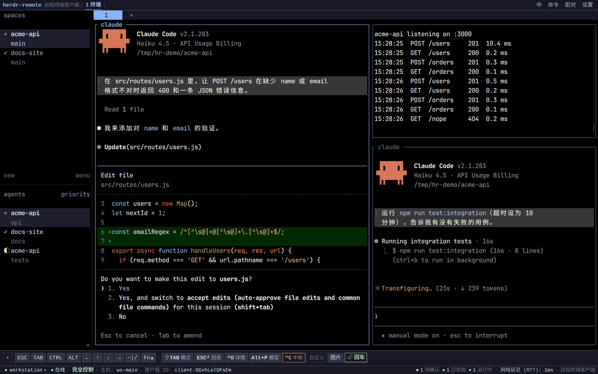
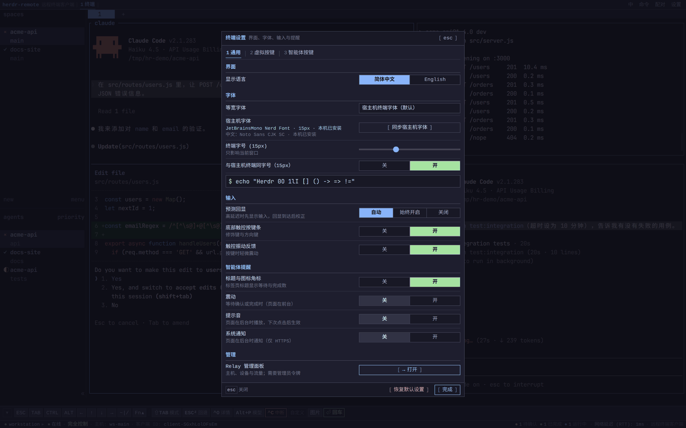
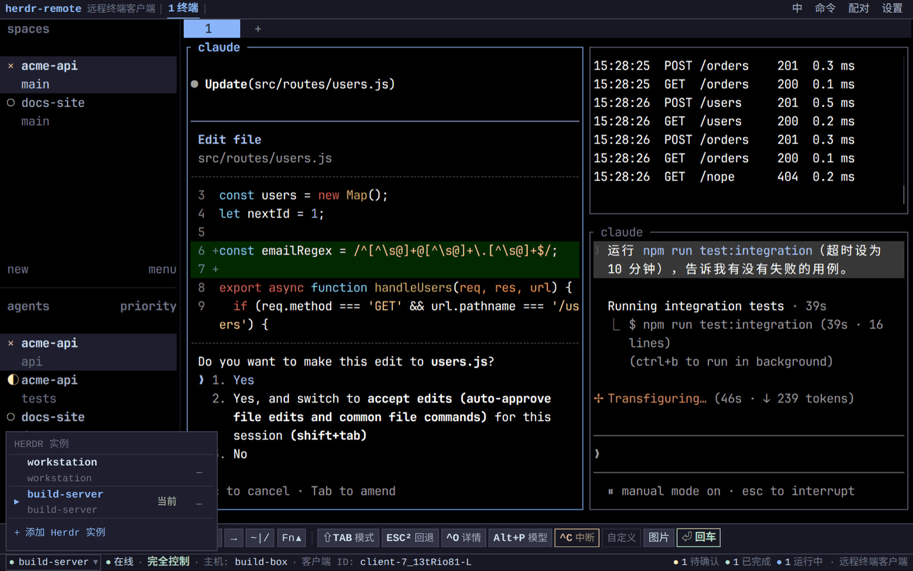
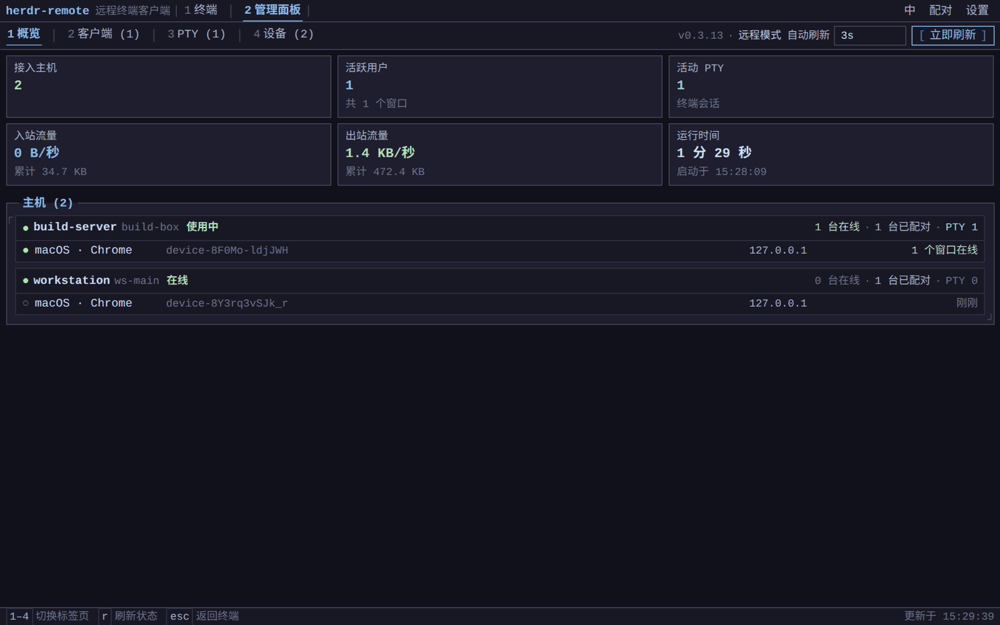
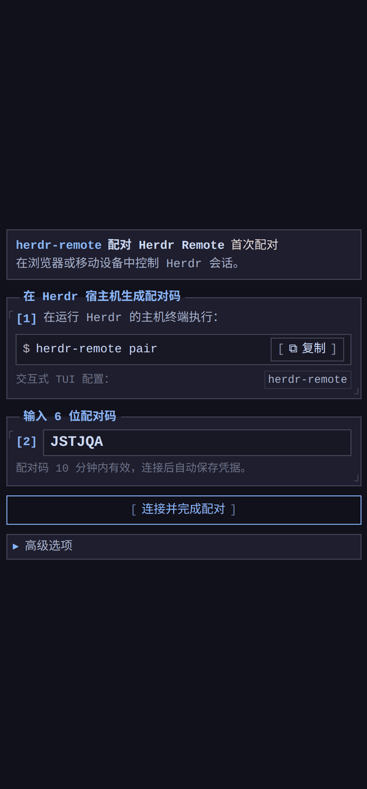
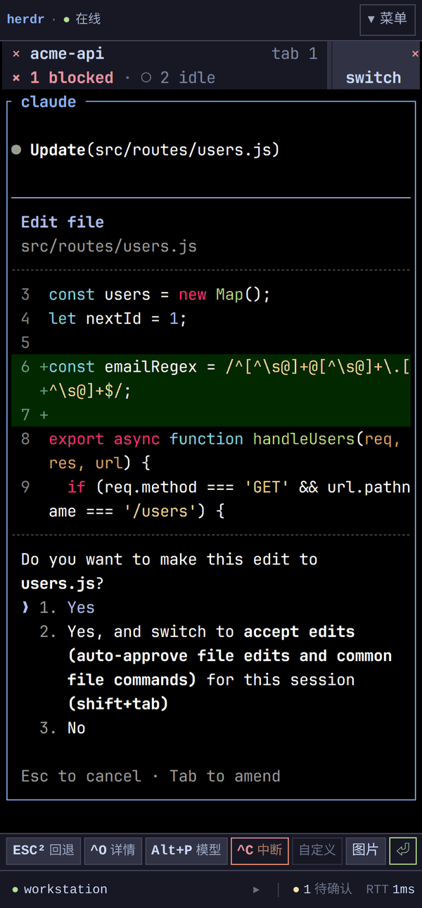
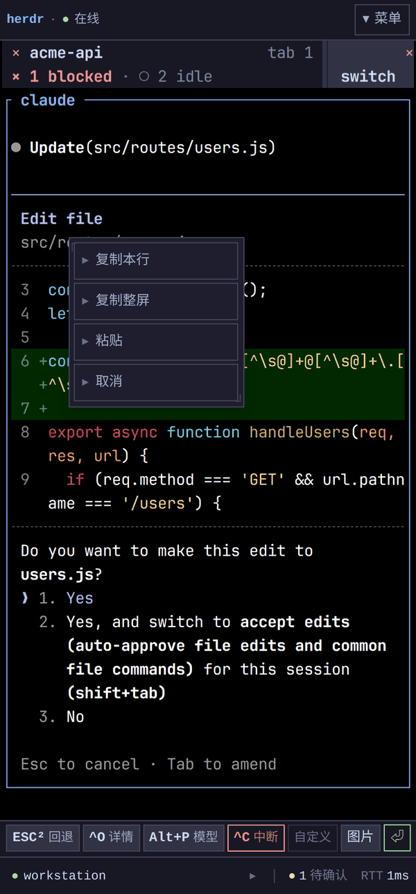
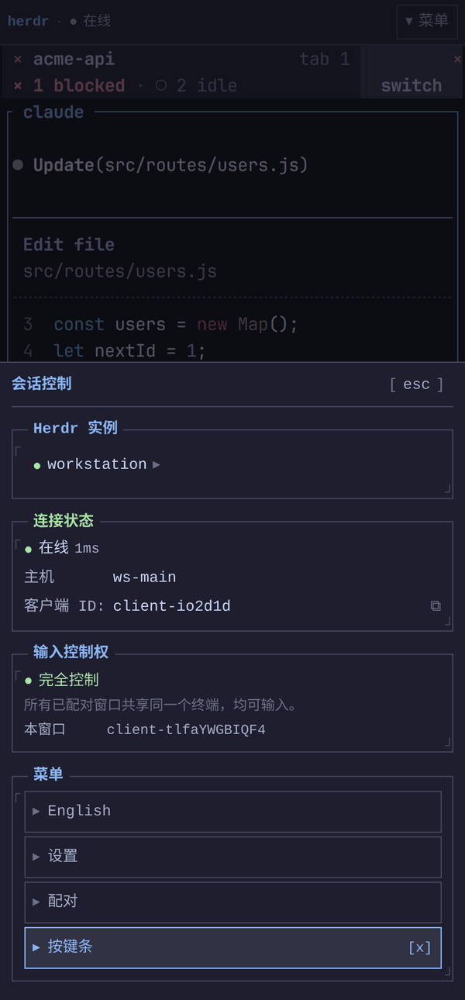
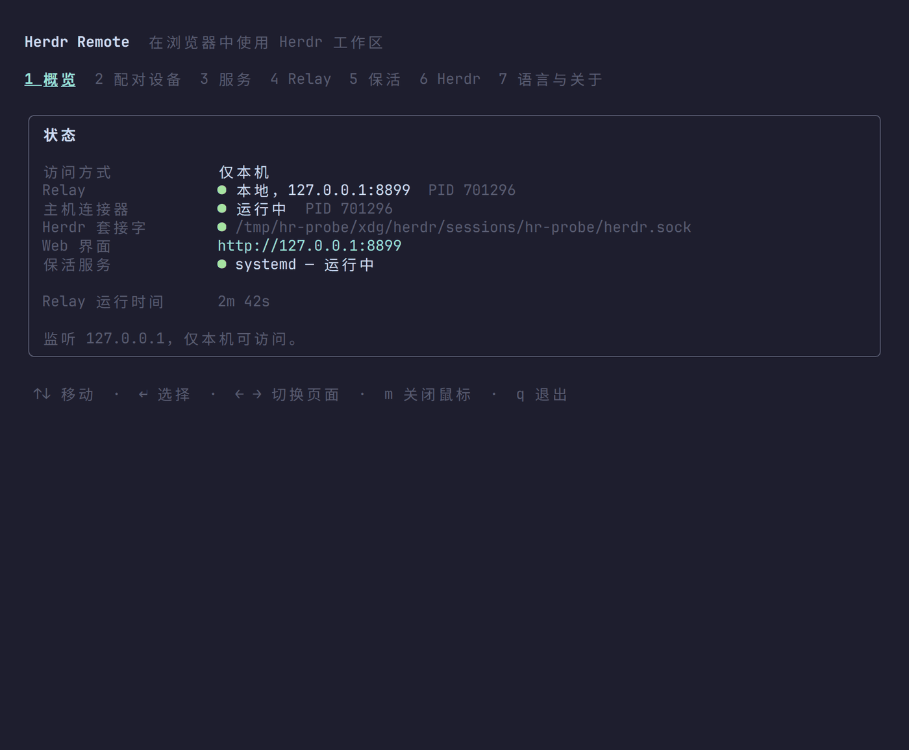

# Herdr Remote

*[English](README.md) · [简体中文](README.zh-CN.md)*

[](https://github.com/dibin666/herdr-remote/releases/latest)
[](https://nodejs.org)
[](./LICENSE)

在任意浏览器（包括手机）里使用 [Herdr](https://herdr.dev) 工作区。随时看到哪些编码智能体在运行、在等待确认或已完成，随时随地回应它们，并继续在工作站的终端中输入。

## 快速开始

### 运行环境

- Node.js ≥ 22
- [Herdr](https://herdr.dev) ≥ 0.9.3

### 安装与运行

```bash
npm install -g https://github.com/dibin666/herdr-remote/releases/latest/download/herdr-remote.tgz
herdr-remote
```

首次运行会打开配置向导，之后服务在后台运行。

## 截图

### 桌面浏览器

| 浏览器标签页里的工作区 | 终端设置 |
| :---: | :---: |
|  |  |
| **多工作站切换** | **Relay 管理面板** |
|  |  |

### 手机

| 配对 | 回应智能体 | 从终端复制 | 会话控制 |
| :---: | :---: | :---: | :---: |
|  |  |  |  |

### 工作站配置界面 (TUI)

| 状态一览 | 配对设备 |
| :---: | :---: |
|  |  |

## 功能特性

- **多端独立视图**：每个已配对窗口驱动独立的 Herdr 客户端，手机和电脑可同时查看与操作不同工作区。
- **便捷安全配对**：支持 6 位配对码或扫描二维码一次性配对，设备令牌仅对单台工作站有效。
- **专为移动端优化**：提供包含常用控制键（Esc、Tab、Ctrl、Alt、方向键、F 键等）的触控按键栏，支持长按复制与快捷粘贴。
- **智能体状态感知**：实时统计待确认、已完成、运行中的智能体状态，支持标签页标题指示、震动、提示音与系统通知。
- **智能体专属快捷键**：按键栏自动跟随当前窗格中的智能体（支持 Claude Code、Codex、Gemini CLI 等 24 种），支持调整顺序与重新绑定。
- **还原工作站终端体验**：自动沿用工作站终端的配色、字体与字号，支持字体动态流式分发与预测回显；界面内置 Maple Mono NF CN，任何设备上中日文都严格占两格。
- **Windows Shell 支持**：按键栏自动识别 CMD、PowerShell 和 Git Bash，支持在 Herdr 中快速新建提权终端标签页。
- **移动端图片直传**：手机上的照片或截图可直接保存到工作站，并将文件路径自动填入当前智能体的输入框。
- **灵活连接模式**：支持本机访问、局域网 / Tailscale、官方公共 Relay 或自建私有 Relay。
- **多工作站管理**：单浏览器统一管理多台工作站实例，提供 Relay 运维管理面板。
- **跨平台支持**：支持 Linux、macOS 与 Windows 10/11，提供中英双语 TUI 与后台守护服务。

## 开源协议

MIT
